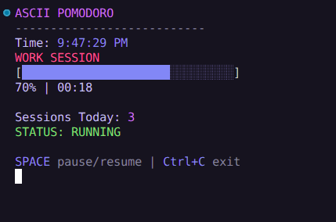
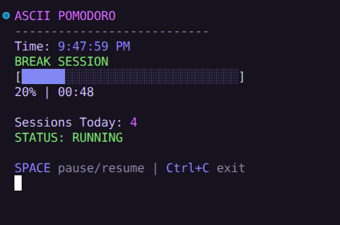

# ASCII Pomodoro

A minimal Tokyo Night themed CLI Pomodoro timer built with Node.js.

## Features

- Work / Break cycle
- Live clock
- ASCII progress bar
- Pause / Resume with spacebar
- Daily session tracking (saved to `stats.json`)
- Terminal bell notification
- Custom durations via CLI arguments

---

## Installation

Clone the repository:

```bash
git clone https://github.com/your-username/ascii-pomodoro.git
cd ascii-pomodoro
```

No dependencies required.

Requires Node.js 16+.

---

## Usage

Run with default durations (25 min work / 5 min break):

```bash
node pomodoro.js
```

Run with custom durations:

```bash
node pomodoro.js 50 10
```

Format:

```
node pomodoro.js <work_minutes> <break_minutes>
```

---

## Controls

- SPACE — pause / resume  
- Ctrl+C — exit  

---

## Session Tracking

Completed work sessions are stored in:

```
stats.json
```

Example:

```json
{
  "2026-03-02": 4
}
```

Each date tracks the number of completed work sessions.

---

## Screenshots

### Work Session



### Break Session



---

## Notes

- Optimized for modern terminals with 24-bit color support
- Designed with Tokyo Night color palette
- No external libraries used